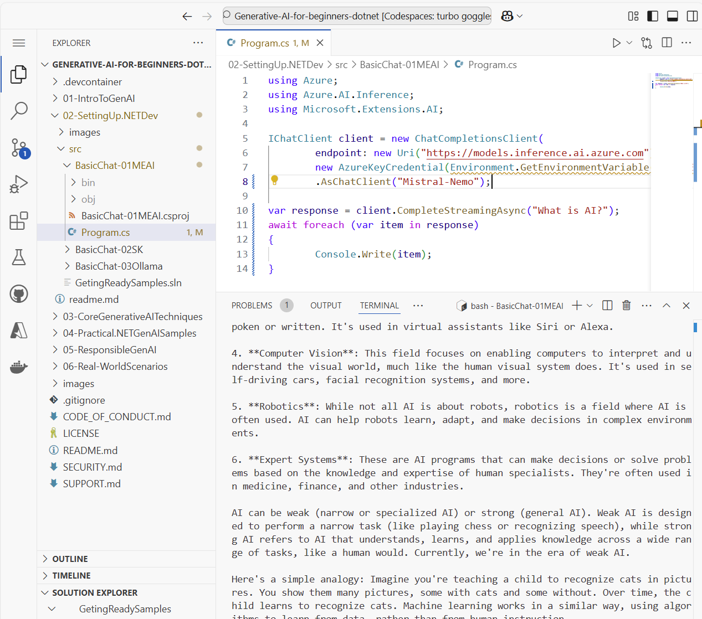

<div align="center">
    <h2>Lesson 2: Setting Up the Environment</h2>
    <h3>Guide: Run Your First AI App with .NET</h3>
    <p><em>Get your first .NET AI application up and running in four steps!</em></p>
</div>

---

### Step 1: Create a Personal Access Token (PAT) on GitHub

To authenticate with the AI model, you’ll need a PAT. Follow these steps:

1. Go to your GitHub [personal access tokens settings](https://github.com/settings/tokens).

1. Generate a token with the necessary permissions.

1. Save the token somewhere safe—you’ll need it!

💡 *Pro Tip:* If you’re deploying to Azure, you can set up a production key instead.

### Step 2: Create a GitHub Codespace

1. Open the repo in GitHub.

2. Click the **Code** button and select **Codespaces**.

3. Create a Codespace for this repository. [Learn more about GitHub Codespaces](https://docs.github.com/en/codespaces/getting-started).

### Step 3: Navigate to the Basic Chat Sample

Once the Codespace is ready:

```bash
cd 02-SettingUp.NETDev/src/BasicChat-01MEAI/
```
### Step 4: Run the Chat App

Run the following command in the terminal:
```bash
dotnet run
```

🎉 **Done!** You’ve just launched your first AI application. Here’s what it looks like:


---

## 🔄 Let’s Add Streaming Capabilities to Your Chat App

Your app might take a while to answer questions. Let’s make it cooler by enabling streaming, so you see responses as they’re generated!

### Step 1: Edit the Program.cs File

Go to the file `/workspaces/Generative-AI-for-beginners-dotnet/02-SettingUp.NETDev/src/BasicChat-01MEAI/Program.cs`

### Step 2: Replace the Code (Lines 10 to End)

Replace everything from line 10 onward with:

```csharp
var response = client.CompleteStreamingAsync("What is AI?");
await foreach (var item in response)
{
    Console.Write(item);
}
```

### Step 3: Run the Chat App

Run the following command:

```bash
dotnet run
```

🎉 **Done!** Now your app streams the response live as it’s being generated. Here’s what it looks like:


---

## 🧠 Test Another Model in Your App

The current app uses the "**Phi-3.5-MoE-instruct**" model. Let’s switch it up and try the "**Mistral-Nemo**" model instead!

### Step 1: Update the Model in Code

Edit the main code to update the model name:

```csharp
IChatClient client = new ChatCompletionsClient(
    endpoint: new Uri("https://models.inference.ai.azure.com"),
    new AzureKeyCredential(Environment.GetEnvironmentVariable("GITHUB_TOKEN")))
    .AsChatClient("Mistral-Nemo");
```

### Step 2: Run the Chat App

Run the following command:
```bash
dotnet run
```
🎉 **Done!** You’ve just switched to a new model. Notice how the response is longer and more detailed. Here’s what it looks like:



---

## 📖 References and Resources

- [Working with GitHub Codespaces](https://docs.github.com/en/codespaces/getting-started)
- [How to Generate a Personal Access Token on GitHub](https://docs.github.com/en/authentication/keeping-your-account-and-data-secure/creating-a-personal-access-token)
- [Microsoft Extensions for AI Documentation](https://learn.microsoft.com/en-us/dotnet/)
