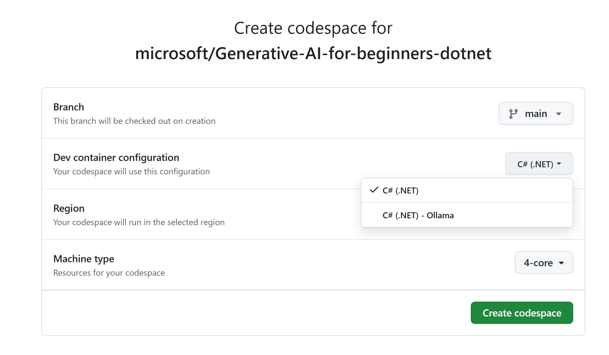
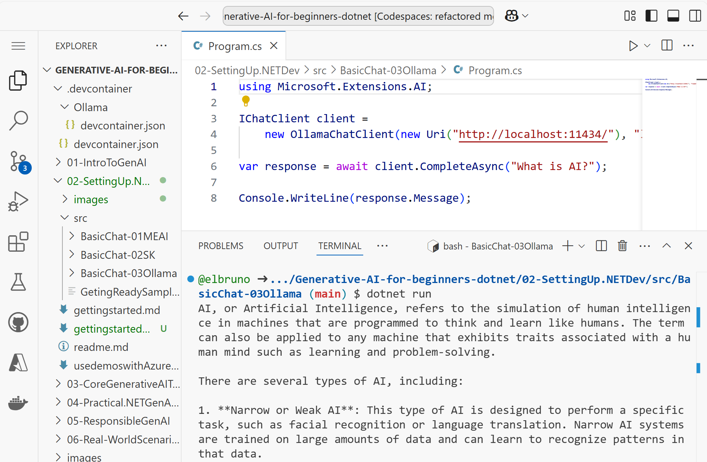

# 🚀 Getting Started in 5 Minutes: Run Your First AI App with .NET with Ollama

Welcome to the **Generative AI for Beginners - .NET** ([GenAINET]) repo! 🎉 Let’s get your first .NET AI application up and running in no time. Follow along as we dive into a step-by-step guide to build, tweak, and enhance your AI app. Let’s go!

## 🏁 Run Your First .NET AI App in 4 Easy Steps 

### Step 1: Create a GitHub Codespace that includes ollama

1. Open the repo in GitHub.

1. Click the **Code** button, select **Codespaces**, select **...** and select **New with options**


1. From the New Codespace options, select the "**C# .NET - Ollama**" definition.



1. This process will take a couple of minutes, wait until the codespace is fully created.

[Learn more about GitHub Codespaces](https://docs.github.com/en/codespaces/getting-started).

### Step 2: Navigate to the Basic Chat Sample

Once the Codespace is ready:

```bash
cd 02-SettingUp.NETDev/src/BasicChat-03Ollama/
```

### Step 3: Run the Chat App

Run the following command in the terminal:

```bash
dotnet run
```

🎉 **Done!** You’ve just launched your first AI application. Here’s what it looks like:



---

## 🔄 Let’s Add Streaming Capabilities to Your Chat App

Your app might take a while to answer questions. Let’s make it cooler by enabling streaming, so you see responses as they’re generated!

### Step 1: Edit the Program.cs File

Go to the file `/workspaces/Generative-AI-for-beginners-dotnet/02-SettingUp.NETDev/src/BasicChat-03Ollama/Program.cs`

### Step 2: Replace the Code (Lines 10 to End)

Replace the current code with:

```csharp
using Microsoft.Extensions.AI;

IChatClient client = new OllamaChatClient(new Uri("http://localhost:11434/"), "llama3.2");

var response = client.CompleteStreamingAsync("What is AI?");
await foreach (var item in response)
{
    Console.Write(item);
}
```

### Step 3: Run the Chat App

Run the following command:

```bash
dotnet run
```

🎉 **Done!** Now your app streams the response live as it’s being generated. 

---

## 🧠 Test Another Model in Your App

The current app uses the "**llama3.2**" model. Let’s switch it up and try the "**phi3.5**" model instead!

### Step 1: Download a new model in ollama

Download the Phi3.5 model running the comamnd:

```bash
ollama pull phi3.5
```

You can learn mode about the [Phi3.5](https://ollama.com/library/phi3.5) and other available models in the [Ollama library](https://ollama.com/library/).

### Step 2: Upload the model name and run the Chat App

Edit the main code to update the model name:

```csharp
IChatClient client = new OllamaChatClient(new Uri("http://localhost:11434/"), "phi3.5");
```

Run the following command:
```bash
dotnet run
```
🎉 **Done!** You’ve just switched to a new model. Notice how the response is longer and more detailed. 

---

## 📖 References and Resources

- [Working with GitHub Codespaces](https://docs.github.com/en/codespaces/getting-started)
- [Microsoft Extensions for AI Documentation](https://learn.microsoft.com/en-us/dotnet/)
