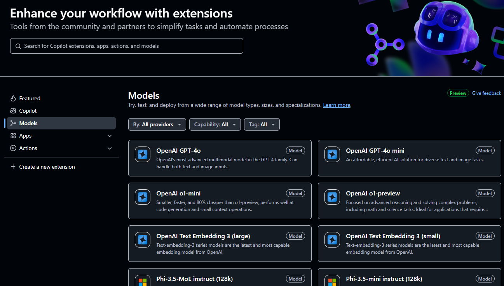
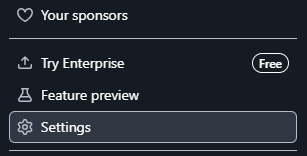
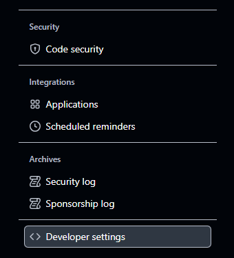
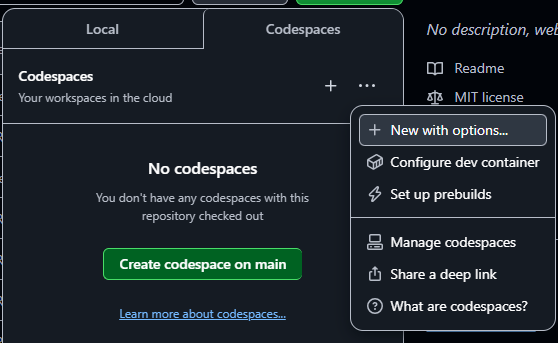

# Setting Up the Development Environment for This Course

This lesson will guide you through setting up your development environment for this course. To ensure your success we've prepared a devcontainer configuration that will provide all the tooling you need to complete the course. You can run the devcontainer in GitHub Codespaces (recommended) or locally on your machine. And we also demonstrate how to set up your GitHub access tokens to interact with GitHub Models.

If you rather not use GitHub Models to interact with LLMs, we have you covered there too with guides to setup Azure OpenAI and Ollama.

---

[](https://microsoft-my.sharepoint.com/:v:/p/brunocapuano/ERTkzBSAfKJEiLw2HLnzHnkBMEbpk17hniaVfr8lCm6how?e=gWOr33&nav=eyJyZWZlcnJhbEluZm8iOnsicmVmZXJyYWxBcHAiOiJTdHJlYW1XZWJBcHAiLCJyZWZlcnJhbFZpZXciOiJTaGFyZURpYWxvZy1MaW5rIiwicmVmZXJyYWxBcHBQbGF0Zm9ybSI6IldlYiIsInJlZmVycmFsTW9kZSI6InZpZXcifX0%3D)

#### What you'll learn in this lesson:

- ⚡ How to setup a development environment with GitHub Codepaces
- 🤖 Configure your development environment to access LLMs via GitHub Models, Azure OpenAI, or Ollama
- 🛠️ Industry-standard tools configuration with .devcontainer
- 🎯 Finally, everything ready to complete the rest of the course

Let's dive in and set up your development environment! 🏃‍♂️

#### Index

1. [Which AI service should I use for this course?](#which-ai-service-should-i-use-for-this-course)
1. [GitHub Models overview](#learn-and-test-ai-models-with-github-models)
1. [Pre-Flight Check: Setting up GitHub Access Tokens](#pre-flight-check-setting-up-github-access-tokens)
1. [Creating a GitHub Codespace](#creating-a-github-codespace)
1. [Testing the Codespace](#verifying-your-codespace-is-running-correctly-with-github-models)
1. [Summary](#summary)

---

## Which AI service should I use for this course?

We provide instructions for setting up your development environment with GitHub Models, Azure OpenAI, and Ollama. You can choose the one that best fits your needs. We recommend using GitHub Models for this course, but you can use any of the three services.

Here's a quick rundown of the services:

- **GitHub Models**: A free service to get started with that allows you to test and interact with various AI models directly within your development environment. It's easy to use from Codespaces and a great way to experiment with different models and understand their capabilities before implementation.
- **Azure OpenAI**: A paid service that provides access to a wide range of AI models. It includes all of the benefits that you'd come to expect from Azure include robust security and scalability. This is a great option for this course if you already have access to an Azure OpenAI subscription.
- **Ollama**: Ollama allows you to run AI models locally on your machine or within a Codespace or devcontainer for free. It's a great option if you prefer to run the models locally, but it is slower than the cloud-based options.

👉 GitHub Models right for you? Follow the rest of this document.
👉 Azure OpenAI have your eye? [This is the document for you](getting-started-azure-openai.md).
👉 Ollama your choice? [This guide has the info you need](getting-started-ollama.md).

## Learn and test AI models with GitHub Models

**GitHub Models** provides an intuitive way to experiment with various AI models directly within your development environment. This feature allows developers to test and interact with different models, understanding their capabilities and limitations before implementation. Through a simple interface, you can explore model responses, evaluate performance, and determine the best fit for your application requirements. Hosted within GitHub's infrastructure, these models offer reliable access and consistent performance, making them ideal for development and testing phases. Best of all, there is a free tier to start your exploration without any cost.



## Pre-flight check: Setting up GitHub Access Tokens

Before we do anything else, we need to configure essential security credentials that will enable our Codespace to interact with GitHub Models and execute our applications securely.

### Creating a Personal Access Token for GitHub Model access

1. Navigate to GitHub Settings:

    - Click your profile picture in the top-right corner
    - Select **Settings** from the dropdown menu

    

1. Access Developer Settings:

    - Scroll down the left sidebar
    - Click on **Developer settings** (usually at the bottom)

    

1. Generate a New Token:

    - Select **Personal access tokens** → **Tokens (classic)**

        

    - In the dropdown in the middle of the page, click **Generate new token (classic)**

        

    - Under "Note", provide a descriptive name (e.g., `GenAI-DotNet-Course-Token`)
    - Set an expiration date (recommended: 7 days for security best practices)
    - There is no need adding any permissions to this token.

> 💡 **Security Tip**: Always use the minimum required scope and shortest practical expiration time for your access tokens. This follows the principle of least privilege and helps maintain your account's tokens safe.

## Creating a GitHub Codespace

Let's create a GitHub Codespace to use for the rest of this course.

1. Open this repository's main page in a new window by [right-clicking here](https://github.com/microsoft/Generative-AI-for-beginners-dotnet) and selecting **Open in new window** from the context menu
1. Click the **Code** dropdown button and then select the **Codespaces** tab
1. Select the **...** option (the three dots) and choose **New with options...**



### Choosing Your development container

From the **Dev container configuration** dropdown, select one of the following options:

**Option 1: C# (.NET)** : This is the option you should use if you plan to use GitHub Models and is our recommended way to complete this course. It has all the core .NET development tools needed for the rest of the course and a fast startup time

**Option 2: C# (.NET) - Ollama**: Ollama allows you to run the demos without needing to connect to GitHub Models or Azure OpenAI. It includes all the core .NET development in addition to Ollama, but has a slower start-up time, five minutes on average. [Follow this guide](getting-started-ollama.md) if you want to use Ollama

You can leave the rest of the settings as they are. Click the **Create codespace** button to start the Codespace creation process.


## Verifying your Codespace is running correctly with GitHub Models

Once your Codespace is fully loaded and configured, lets run a sample app to verify everything is working correctly:

1. Open the terminal. You can open a terminal window by typing **Ctrl+\`** (backtick) on Windows or **Cmd+`** on macOS.

1. Switch to the proper directory by running the following command:

    ```bash
    cd 02-SettingUp.NETDev\src\BasicChat-01MEAI
    ```

1. Then run the application with the following command:

    ```bash
    dotnet run
    ```

1. It may take a couple of seconds, but eventually the application should output a message similar to the following:

    ```bash
    AI, or artificial intelligence, refers to the simulation of human intelligence in machines that are programmed to think and learn like humans. It is a broad field of computer science that focuses on creating systems and algorithms capable of performing tasks that typically require human intelligence. These tasks include problem-solving,

    ...
    ```

> ⚠️ **Note**: Something not working? [Open an issue](https://github.com/microsoft/Generative-AI-for-beginners-dotnet/issues/new?template=Blank+issue) and we'll help you out.

## Summary

In this lesson, you learned how to set up your development environment for the rest of the course. You created a GitHub Codespace and configured it to use GitHub Models, Azure OpenAI, or Ollama. You also learned how to create a personal access token for GitHub Models and how to run a sample application to verify everything is working correctly.

### Additional Resources

- [GitHub Codespaces Documentation](https://docs.github.com/en/codespaces)
- [GitHub Models Documentation](https://docs.github.com/en/github-models/prototyping-with-ai-models)

### Next Steps

Next, we'll explore how to create your first AI application! 🚀

👉 [Core Generative AI Techniques](../03-CoreGenerativeAITechniques/readme.md)
