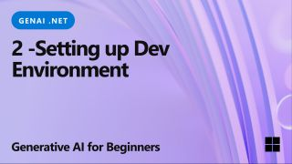
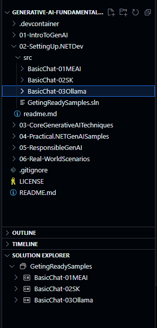

# Setting Up the Development Environment for This Course

This lesson will guide you through setting up your development environment for this course. To ensure your success we've prepared a devcontainer configuration that will provide all the tooling you need to complete the course. You can run the devcontainer in GitHub Codespaces (recommended) or locally on your machine. And we also demonstrate how to set up your GitHub access tokens to interact with GitHub Models.

If you rather not use GitHub Models to interact with LLMs, we have you covered there too with guides to setup Azure OpenAI and Ollama.

---

#### What you'll learn in this lesson:

- ⚡ How to setup a development environment with GitHub Codepaces
- 🤖 Configure your development environment to access LLMs via GitHub Models, Azure OpenAI, or Ollama
- 🛠️ Industry-standard tools configuration with .devcontainer
- 🎯 Finally, everything ready to complete the rest of the course

Let's dive in and set up your development environment! 🏃‍♂️

#### Index

1. [GitHub Models overview](#learn-and-test-ai-models-with-github-models)
1. [Pre-Flight Check: Setting up GitHub Access Tokens](#pre-flight-check-setting-up-github-access-tokens)
1. [Taking Off with AI 🚀](#taking-off-with-ai-)
1. [Running the Solution in Your Codespace](#running-the-solution-in-your-codespace)
1. [Conclusions and Resources](#conclusions-and-resources)

---

## Learn and test AI models with GitHub Models

**GitHub Models** provides an intuitive way to experiment with various AI models directly within your development environment. This feature allows developers to test and interact with different models, understanding their capabilities and limitations before implementation. Through a simple interface, you can explore model responses, evaluate performance, and determine the best fit for your application requirements. Hosted within GitHub's infrastructure, these models offer reliable access and consistent performance, making them ideal for development and testing phases. Best of all, there is a free tier to start your exploration without any cost.

## Pre-flight check: Setting up GitHub Access Tokens

Before we do anything else, we need to configure essential security credentials that will enable our Codespace to interact with GitHub Models and execute our applications securely.

### Creating a Personal Access Token

1. Navigate to GitHub Settings:

    - Click your profile picture in the top-right corner
    - Select **Settings** from the dropdown menu

    

1. Access Developer Settings:

    - Scroll down the left sidebar
    - Click on **Developer settings** (usually at the bottom)

    

1. Generate a New Token:

    - Select **Personal access tokens** → **Tokens (classic)**

        

    - In the dropdown in the middle of the page, click **Generate new token (classic)**

        

    - Under "Note", provide a descriptive name (e.g., `GenAI-DotNet-Course-Token`)
    - Set an expiration date (recommended: 7 days for security best practices)
    - There is no need adding any permissions to this token.

> 💡 **Security Tip**: Always use the minimum required scope and shortest practical expiration time for your access tokens. This follows the principle of least privilege and helps maintain your account's tokens safe.

## Setting up your development environment

Let's create a GitHub Codespace to use for the rest of this course:

1. Open this repository's main page in a new window by [right-clicking here](https://github.com/microsoft/Generative-AI-for-beginners-dotnet) and selecting **Open in new window** from the context menu
1. Click the **Code** dropdown button and then select the **Codespaces** tab
1. Select the **...** option (the three dots) and choose **New with options...**

### Choosing Your development container

From the **Dev container configuration** dropdown, select one of the following options:

**Option 1: C# (.NET)** : This is the option you should use if you plan to use GitHub Models. It has all the core .NET development tools needed for the rest of the course and a fast startup time

**Option 2: C# (.NET) - Ollama**: Ollama allows you to run the demos without needing to connect to GitHub Models or Azure OpenAI. It includes all the core .NET development in addition to Ollama, but has a slower start-up time, five minutes on average

You can leave the rest of the settings as they are. Click the **Create codespace** button to start the Codespace creation process.

## Verifying your Codespace is running correctly

Once your Codespace is fully loaded and configured, lets run a sample app to verify everything is working correctly:

1. **Access the Solution Explorer**

    - Locate the Solution Explorer in the left sidebar
    - If collapsed, click the Explorer icon (usually the top icon)
    - The solution structure should be visible, containing all projects

     

2. **Launch the Debug Session**

    - Right-click on the Solution node to be run, in the Explorer
    - Navigate to "Debug" in the context menu
    - Select "Start New Instance"

     

> ⚠️ **Note**: If you encounter any build errors, ensure all required dependencies are properly restored by running `dotnet restore` in the terminal.

## Conclusions and resources

### Additional Resources

> ⚠️ **Note**: If you encounter any issues, open an issue in the repository.

- [GitHub Codespaces Documentation](https://docs.github.com/en/codespaces)
- [GitHub Models Documentation](https://docs.github.com/en/github-models/prototyping-with-ai-models)

### Next Steps

Next, we'll explore how to create your first AI application using these tools. 

    <a href="../03-CoreGenerativeAITechniques/readme.md">Go to Chapter 3</a>

