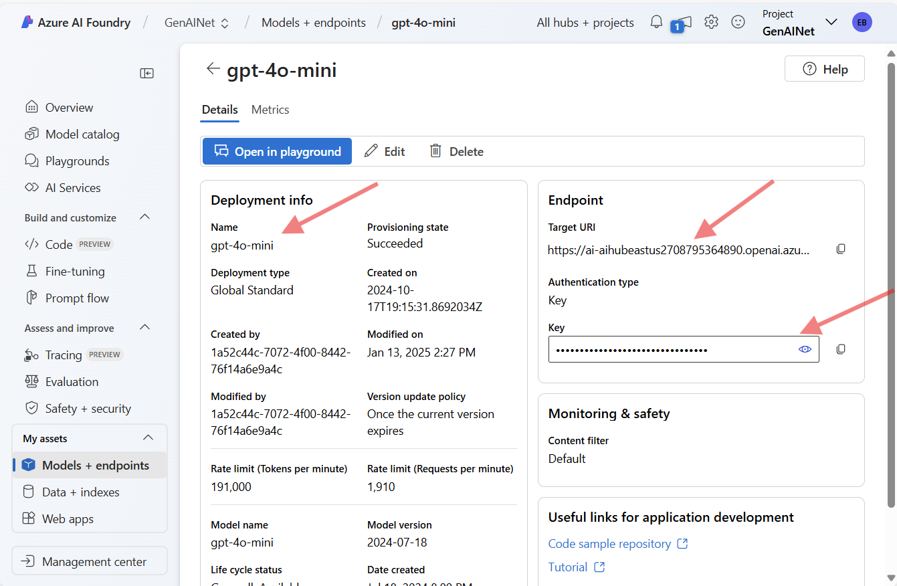
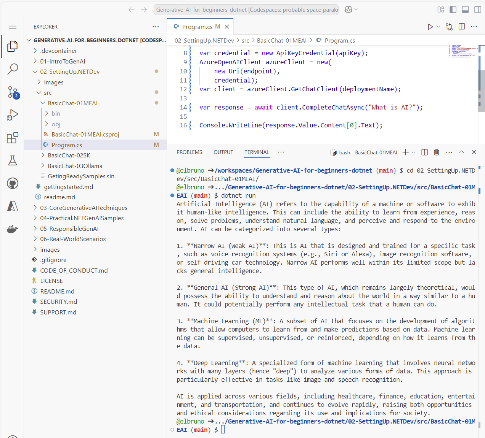
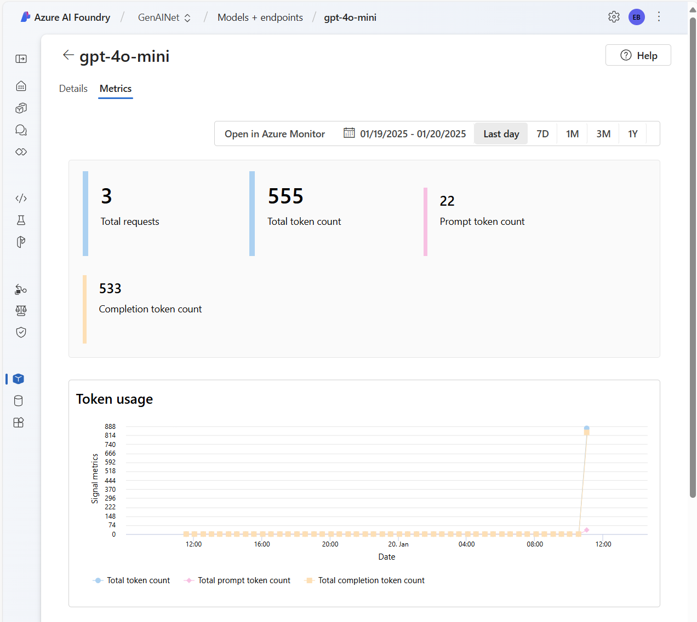

# 🌟 Use Azure AI Foundry models in your .NET AI applications

Welcome to the **Generative AI for Beginners - .NET** ([GenAINET]) repo! Ready to explore how to use models from Azure AI Foundry in your AI applications? Let’s dive right in!

---

## 🚀 Step 1: Create a Hub and Project in Azure AI Foundry

Follow these steps to set up your project:

1. Go to the [Azure AI Foundry Portal](https://azure.microsoft.com/en-us/products/ai-services/).

2. Sign in with your Azure account.

3. Navigate to the **Hubs** section and click **Create Hub**.
    - Give your hub a name (e.g., "MyAIHub").
    - Choose a region closest to you.
    - Select the appropriate subscription and resource group.
    - Click **Create**.

4. Once your hub is created, go to the **Projects** section and click **Create Project**.

    - Choose your previously created hub.
    - Give your project a name (e.g., "GenAINET").
    - Click **Create**.

🎉 **Done!** You’ve just created your first project in Azure AI Foundry.

---

## 🌐 Step 2: Deploy a Large Language Model in Azure AI Foundry

Now, let’s deploy a **gpt-4o-mini** model to your project:

1. In the Azure AI Foundry portal, navigate to your project.

2. Click on **Models and Endpoints** and then **Deploy Model**.

3. Search for "gpt-4o-mini" in the model catalog.

4. Select the model, specify a deployment name (e.g., "gpt-4o-mini"), and configure the compute resources.

5. Click **Deploy** and wait for the model to be provisioned.

6. Once deployed, note the **Model Name**, **Endpoint URL**, and **API Key** from the model details page.

🎉 **Done!** You’ve deployed your first Large Language Model in Azure AI Foundry.



***Note:** The endpoint maybe similar to `https://< your hub name>.openai.azure.com/openai/deployments/gpt-4o-mini/chat/completions?api-version=2024-08-01-preview`. The endpoint name that we need is only `https://< your hub name>.openai.azure.com/`.*

---

## 💻 Step 3: Use the New Model in Your Application

Now let’s update the code to use the newly deployed model.

### Step 1: Create a GitHub Codespace

1. Open this repository on GitHub.

2. Click the **Code** button and select **Codespaces**.

3. Create a Codespace for this repository. [Learn more about GitHub Codespaces](https://docs.github.com/en/codespaces/getting-started).

### Step 2: Navigate to the Chat Sample

Once the Codespace is ready, open the terminal and run:

```bash
cd 02-SettingUp.NETDev/src/BasicChat-01MEAI/
```

### Step 3: Add the Azure.AI.OpenAI Package

Run the following command to add the required package:

```bash
dotnet add package Azure.AI.OpenAI
```

[More information about Azure.AI.OpenAI](https://www.nuget.org/packages/Azure.AI.OpenAI/2.1.0#show-readme-container).

### Step 4: Update the Program.cs File

Edit `/workspaces/Generative-AI-for-beginners-dotnet/02-SettingUp.NETDev/src/BasicChat-01MEAI/Program.cs` with the following code. 

Replace `< deployment name >`, `< endpoint >`, and `< api key >` with your actual model details:

```csharp
using System.ClientModel;
using Azure.AI.OpenAI;

var deploymentName = "< deployment name > ";
var endpoint = "< endpoint >";
var apiKey = "< api key >";

var credential = new ApiKeyCredential(apiKey);
AzureOpenAIClient azureClient = new(
    new Uri(endpoint),
    credential);
var client = azureClient.GetChatClient(deploymentName);

var response = await client.CompleteChatAsync("What is AI?");

Console.WriteLine(response.Value.Content[0].Text);
```

### Step 5: Run the Chat App

Run the following command:

```bash
dotnet run
```



🎉 **Done!** Your AI application is now using the models deployed to Azure AI Foundry. Enjoy features like content safety and enhanced model capabilities.



---

## 🔗 References and Resources

- [Azure AI Foundry Documentation](https://learn.microsoft.com/en-us/azure/ai-services/)
- [Working with GitHub Codespaces](https://docs.github.com/en/codespaces/getting-started)
- [How to Deploy Models in Azure AI Foundry](https://learn.microsoft.com/en-us/azure/ai-services/deploy/)
- [Azure.AI.OpenAI NuGet Package](https://www.nuget.org/packages/Azure.AI.OpenAI)