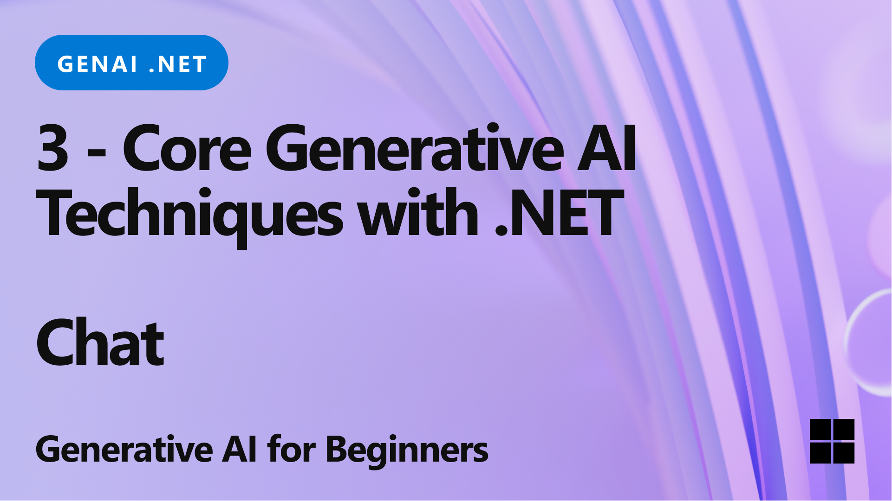
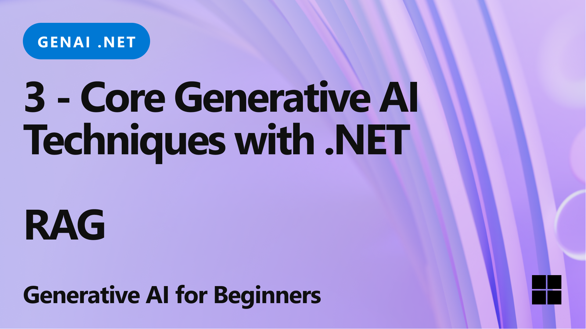
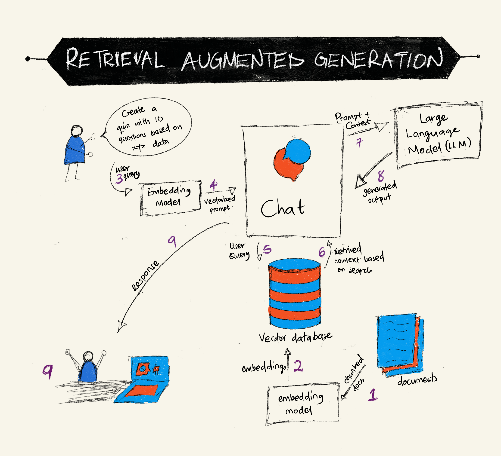
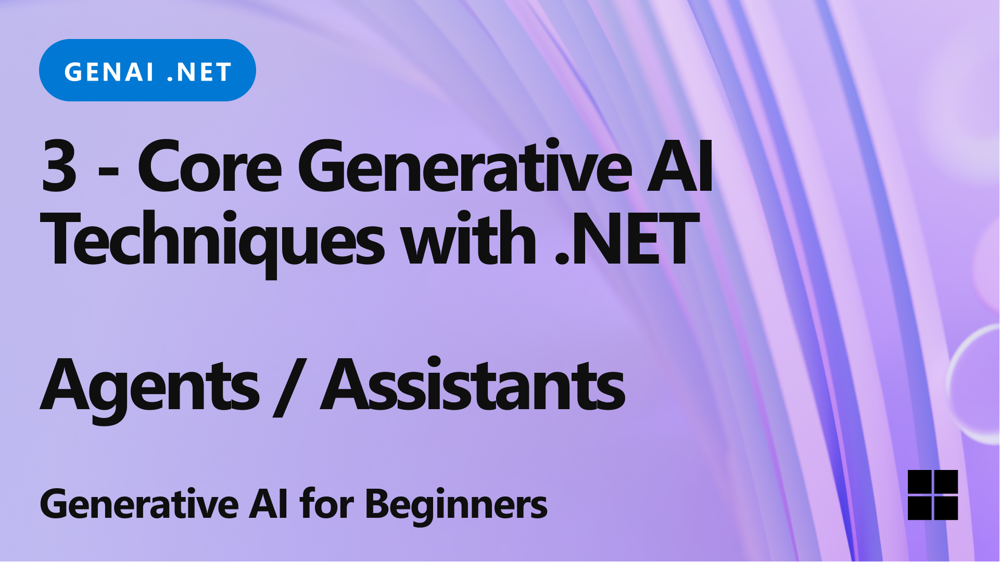

<div align="center">
    <h1>Generative AI Fundamentals for .NET</h1>
    <h2>Lesson 3: Core Generative AI Techniques</h2>
    <p><em>Exploring fundamental approaches to Generative AI</em></p>
</div>

> 💡 **Quick Summary**: This chapter covers from basic concepts like Language Model Completion, RAG to Audio/Video generation and upcoming topics like Agents/Assistants and Real-Time audio/video.

---

**What You’ll Learn:**
- 🌟 LLM Completions/Chat flows in .NET  
- 🔗 Functions & Plugins with LLMs  
- 🔎 Retriever-Augmented Generation (RAG)  
- 👀 Vision-based AI approaches  
- 🔊 Audio creation and transformations  
- 🎞️ Video generation techniques  
- 🧩 Agents & Assistants (coming soon)  
- ⚡ Real-Time Audio & Video (coming soon)

Let's understand how impactful those models can be impactful to your workflow and how can you use them efficiently.

**Index:**
1. [LM Completions / Chat](#lm-completions--chat)
2. [Functions and Plugins using LLMs](#functions-and-plugins-using-llms)
3. [RAG - Retrieved-Augmented Generation](#rag---retrieved-augmented-generation)
4. [Vision](#vision)
5. [Real-Time Audio](#real-time-audio)
6. [Agents / Assistants (coming soon)](#agents--assistants-coming-soon)
7. [Conclusions and resources](#conclusions-and-resources)

## LM Completions / Chat

(5 min video .NET explanation, links to main GenAI and content)

  

First, let's remember the basic concepts of Language Models and how they can be used to generate text. As we saw in Chapter One, Language Models are a type of AI model that can generate text based on the input it receives. This input can be a prompt, a question, or a sentence, and the model will generate a response based on the patterns it has learned from the data it was trained on.

Using Generative AI models helps to generate text that is coherent and contextually relevant. Hosting multiple models and auxiliating the system to be capable of open domain conversations.

This includes how to create the system message, how to interact with the user, and how to generate the response. The system message is the message that the system sends to the user to start the conversation. Being key for your User Experience, it should be clear and concise, and it should set the tone for the conversation. 

> 💡 **Pro Tip**: Learn more about Language Models Completion and flow control in [Generative AI for Beginners](https://github.com/microsoft/generative-ai-for-beginners/tree/main/07-building-chat-applications/)

Tools, like those we presented in the first chapter, can be used in a multitude of scenarios, for example Semantic Kernel, and Microsoft Extensions AI (MEAI).

Semantic Kernel is a .NET library that provides a simple API to interact with multiple language models and other AI services. It is designed to be easy to use and flexible, allowing you to build a wide range of applications that use AI.

The next picture will show the steps we follow in the creation of a chatbot using Semantic Kernel:


Look at the following code snippet to implement a simple chatbot using Semantic Kernel and Azure OpenAI chat completion:

```csharp
// Create a kernel with Azure OpenAI chat completion service, using the model ID, endpoint, and API key
var builder = Kernel.CreateBuilder().AddAzureOpenAIChatCompletion(modelId, endpoint, apiKey);

// Add enterprise components, such as logging and telemetry
builder.Services.AddLogging(services => services.AddConsole().SetMinimumLevel(LogLevel.Trace));

// Build the kernel, which will allow you to interact with the multiple services and models
Kernel kernel = builder.Build();
var chatCompletionService = kernel.GetRequiredService<IChatCompletionService>();

// Add a plugin, this plugin allows us to easily add new functionality to the kernel. For example, this plugin adds a new command to the kernel that allows you to turn on and off the lights in your house.
kernel.Plugins.AddFromType<LightsPlugin>("Lights");

// Enable planning, which allows the kernel to plan and execute actions based on the user's input
OpenAIPromptExecutionSettings openAIPromptExecutionSettings = new() 
{
    FunctionChoiceBehavior = FunctionChoiceBehavior.Auto()
};
```

To invoke the chatbot, you can use the following code snippet:

```csharp
// Create a history store the conversation, this will allow the chatbot to remember the context of the conversation and generate more relevant responses
var history = new ChatHistory();

// Initiate a back-and-forth chat on the console
string? userInput;
do {
    // Collect user input
    Console.Write("User > ");
    userInput = Console.ReadLine();

    // Add user input
    history.AddUserMessage(userInput);

    // Get the response from the AI, using the Azure OpenAI chat completion service, the chat history, the execution settings, and the kernel
    var result = await chatCompletionService.GetChatMessageContentAsync(
        history,
        executionSettings: openAIPromptExecutionSettings,
        kernel: kernel);

    // Print the results for the user
    Console.WriteLine("Assistant > " + result);

    // Add the message from the agent to the chat history store
    history.AddMessage(result.Role, result.Content ?? string.Empty);
} while (userInput is not null);
```	

> ⚠️ **Note**: Learn more about Semantic Kernel go to [the documentation for Semantic Kernel](https://learn.microsoft.com/en-us/semantic-kernel/get-started/quick-start-guide?pivots=programming-language-csharp)

For MEAI, the Microsoft Extensions AI (MEAI) is a .NET library that provides a simple API to interact with multiple language models and other AI services. It is designed to be easy to use and flexible, allowing you to build a wide range of applications that use AI.

Semantic Kernel uses to interact with .NET abstractions and services, for example providing interfaces for services like `IChatCompletionService` and `IPlugin`.

> ⚠️ **Note**: Learn more about MEAI go to [the documentation for MEAI](https://devblogs.microsoft.com/dotnet/introducing-microsoft-extensions-ai-preview/)

On video, we can see how Bruno Capuano, a Cloud Advocate at Microsoft, explaing how can we use the demo at `src/BasicChat-01MEAI` and `src/BasicChat-02SemanticKernel` to create a chatbot using MEAI and Semantic Kernel. 

Lastly, take a look on Olama, a coordinator between local models, cloud models and other AI services. It is designed to be easy to use and flexible, allowing you to build a wide range of applications that use AI. We can see how it can be used in the video at the start of the lesson.

Learn more about Ollama and it's integration with MEAI and Semantic Kernel in the video at the start of the lesson.

> ⚠️ **Note**: Learn more about Ollama go to [the documentation for Ollama](https://https://github.com/ollama/ollama/tree/main/docs)

## Functions and Plugins using LLMs

  

Exploring the concept of Functions and Plugins using LLMs, we can see how we can use the models to create a more complex system. Semantic Kernel and MEAI provide a way to create plugins that can be used to extend the functionality of the system.

Looking at the following code snippet, we can see how to call a plugin using Semantic Kernel:

```csharp
// Get the chat completions and create the calls for all adressable functions
    OpenAIPromptExecutionSettings openAIPromptExecutionSettings = new()
    {
        ToolCallBehavior = ToolCallBehavior.AutoInvokeKernelFunctions
    };
```

This code snippet shows how to create a plugin using Semantic Kernel, this plugin allows you to get the current temperature for a city, with the context of the conversation:

```csharp
public class CityTemperaturePlugIn
{
    [KernelFunction, Description("Returns the current temperature for a city.")]
    public async Task<string> GetCityTemperature(
        Kernel kernel,
        [Description("The city to check the temperature")] string city
    )
    {
        Console.WriteLine($"== FUNCTION CALL START ==");
        Console.WriteLine($"== City: {city}");

        var random = new Random();
        var temperature = random.Next(-10, 10);
        var message = $"The current temperature in {city} is {temperature} C";

        Console.WriteLine($"== Generated message: {message}");
        Console.WriteLine($"== FUNCTION CALL END ==");
        return message;
    }
}
```

> ⚠️ **Note**: Learn more about Functions and Plugins using LLMs go to [the documentation for Semantic Kernel](https://learn.microsoft.com/en-us/semantic-kernel/concepts/plugins/?pivots=programming-language-csharp)

## RAG - Retrieved-Augmented Generation

(5 min video .NET explanation, links to main GenAI and content)



RAG is an architecture that combines a retriever and a language model to create a more powerful applcation. The retriever is used to find relevant information from a large vector dataset, and the language model is used to generate the response, augmenting the previous prompt with the retrieved information.

Some situations where RAG can be used are where we need to generate a response based on a large amount of data, or where we need to generate a response based on a specific context. Remember, Language Models have a knowledge cutoff date and may not have the most recent information. Plus, they may need some context to generate a more accurate response.

Look at the following infographic from [Generative AI for Beginners](https://github.com/microsoft/generative-ai-for-beginners/tree/main/15-rag-and-vector-databases) to understand how RAG works:



As we can see, the RAG model gets our question from the prompt and retrieves the most relevant information from the database. Then, augments the prompt with the retrieved information, sending it to the language model to generate the response.

For our .NET applications, we can use Semantic Kernel and MEAI to implement RAG.

First, we need the information which will be injected to be retrieved, for example, a movie database. 

In Semantic Kernel, we can use the following code snippet to get some data from Memory:

```csharp
// add facts to the collection
Dictionary<string, string> memoryInformation = new()
{
    {"1", "Gisela's favourite super hero is Batman" },
    {"2", "The last super hero movie watched by Gisela was Guardians of the Galaxy Vol 3" },
    {"3", "Bruno's favourite super hero is Invincible" },
    {"4", "The last super hero movie watched by Bruno was Deadpool and Wolverine" },
    {"5", "Bruno does not like the super hero movie: Eternals" }
};

const string MemoryCollectionName = "fanFacts";
foreach (var information in memoryInformation)
{
    await memory.SaveInformationAsync(MemoryCollectionName,
        id: information.Key,
        text: information.Value);
}

TextMemoryPlugin memoryPlugin = new(memory);
```

Above, we are using the `TextMemoryPlugin` to save the information in the memory, and then we can use it to retrieve the information in the conversation. To retrieve the information, we can use the following code snippet:

```csharp
// Restructuring the conversation to use the question, agumented with the memory content
var prompt = @"Question: {{$input}}
    Answer the question using the memory content: {{Recall}}";

// Add the user question to the conversation history
history.AddUserMessage(prompt);

// Pass the question to the kernel, along with the collection name and the conversation history
var arguments = new KernelArguments(settings)
{
    { "input", question },
    { "collection", MemoryCollectionName },
    { "messages", history }
};

// Get the response from the kernel
var newResponse = kernel.InvokePromptStreamingAsync<StreamingChatMessageContent>(prompt, arguments);
```

Semantic Kernel provides a way to create a plugin that can be used to retrieve information from a Dictionary, this plugin can be used to retrieve information from a database, a file, or any other source of information.

In `src/MEAIVectorsShared` we can see how to create a mock vector database using MEAI. 

```csharp
public static List<Movie<T>> GetMovieList()
    {
        var movieData = new List<Movie<T>>()
        {
            new Movie<T>
            {
                Key = KeyGeneratorReturnNext(),
                Title = "Lion King",
                Year = 1994,
                Category = "Animation, Family, Adventure",
                Description = "The Lion King (1994) is a classic Disney animated film that tells the story of a young lion named Simba who embarks on a journey to reclaim his throne as the king of the Pride Lands after the tragic death of his father."
            },
            new Movie<T>
            {
                Key = KeyGeneratorReturnNext(),
                Title = "Inception",
                Year = 2010,
                Category = "Science Fiction, Action, Thriller",
                Description = "Inception (2010) is a science fiction film directed by Christopher Nolan that follows a group of thieves who enter the dreams of their targets to steal information."
            },

...
```

 The following code snippet shows how to create a RAG model using MEAI:

```csharp
// Tries to the movie data from the database
var movies = vectorStore.GetCollection<int, MovieVector<int>>("movies");
// Create the collection if it doesn't exist
await movies.CreateCollectionIfNotExistsAsync();
// Get the movie data from the database
var movieData = MovieFactory<int>.GetMovieVectorList();

// Get embeddings generator in this case Ollama
IEmbeddingGenerator<string, Embedding<float>> generator =
    new OllamaEmbeddingGenerator(new Uri("http://localhost:11434/"), "all-minilm");

// Generate embeddings for movies
foreach (var movie in movieData)
{
    movie.Vector = await generator.GenerateEmbeddingVectorAsync(movie.Description);
    await movies.UpsertAsync(movie);
}
```

To retrieve the information from the database, we can use the following code snippet:

```csharp
// Get the movie data, generate the embeddings for the query, and search for the most relevant movies
var query = "A family friendly movie that includes ogres and dragons";
var queryEmbedding = await generator.GenerateEmbeddingVectorAsync(query);
var searchOptions = new VectorSearchOptions()
{
    Top = 2,
    VectorPropertyName = "Vector"
};
```

Vector stores can be useful quickly to retrieve information, retrieving more information from the source or local information. With this objective, you can use Azure AI Search or locally Qdrant. 

To integrate Qdrant with MEAI, you can use the following code snippet, look into the sample `src/RAGSimple-04MEAIVectorsQdrant` for more info:

```csharp
// Create a vector store using Qdrant
var vectorStore = new QdrantVectorStore(new QdrantClient("localhost"));

/// Using the vector store to get the collection of movies
var movies = vectorStore.GetCollection<ulong, MovieVector<ulong>>("movies");
```

> ⚠️ **Note**: Learn more about RAG go to [Generative AI for Beginners](https://github.com/microsoft/generative-ai-for-beginners/tree/main/15-rag-and-vector-databases) and understand RAG in depth!


## Vision
(5 min video .NET explanation, links to main GenAI and content)


Vision-based AI approaches are used to generate and interpret images. This can useful for a wide range of applications, such as image recognition, image generation, and image manipulation. Current models are multi-modal, meaning they can accept a variety of inputs, such as text, images, and audio, and generate a variety of outputs. In this case, we are going to focus on image recognition.

> 💡 **Pro Tip**: Learn more about Image Generation approaches in [Generative AI for Beginners](https://github.com/microsoft/generative-ai-for-beginners/tree/main/09-building-image-applications)

Meaning that we could use this technology to make questions about images and getting them formatted for any format or input needed. In example, questioning how many people are in the image, getting the answer in a JSON format, then sending for a function in your workflow.

For vision applications, we can use Semantic Kernel, MEAI and basic models to implement vision-based AI approaches.

Send images to the model with the following code snippet:

```csharp
// read the image bytes, create a new image content part and add it to the messages
AIContent aic = new ImageContent(File.ReadAllBytes(image), "image/jpeg");
List<ChatMessage> messages =
[
    new ChatMessage(ChatRole.User, prompt),
    new ChatMessage(ChatRole.User, [aic])
 ];

var imageAnalysis = await chatClient.CompleteAsync(messages);
```

Videos can be analyzed in the same way, using the following code snippet:

```csharp
// Create the OpenAI files that represent the video frames, and add them to the messages
int step = (int)Math.Ceiling((double)frames.Count / PromptsHelper.NumberOfFrames);

// Show in the console the total number of frames and the step that neeeds to be taken to get the desired number of frames for the video analysis
Console.WriteLine($"Video total number of frames: {frames.Count}");
Console.WriteLine($"Get 1 frame every [{step}] to get the [{PromptsHelper.NumberOfFrames}] frames for analysis");

for (int i = 0; i < frames.Count; i += step)
{
    // Save the frame to the "data/frames" folder, using the frame number as the file name and the OpenCV library
    string framePath = Path.Combine(dataFolderPath, "frames", $"{i}.jpg");
    Cv2.ImWrite(framePath, frames[i]);

    // Read the image bytes, create a new image content part and add it to the messages
    AIContent aic = new ImageContent(File.ReadAllBytes(framePath), "image/jpeg");
    var message = new ChatMessage(ChatRole.User, [aic]);
    messages.Add(message);
}

// Send the messages to the chat client
var completionUpdates = chatClient.CompleteStreamingAsync(chatMessages: messages);
```

## Real-Time Audio


Real-Time Audio is a technique that allows you to generate and transcribe audio in real-time. This can be useful for a wide range of applications, speech synthesis, and audio manipulation. This is possible using [Whisper](https://github.com/openai/whisper), a real-time audio generation model that can  transcribe audio in real-time. To generate audio, you need to use the [Cognitive Services Speech SDK](https://learn.microsoft.com/en-us/azure/ai-services/speech-service/quickstarts/setup-platform?tabs=windows%2Cubuntu%2Cdotnetcli%2Cdotnet%2Cjre%2Cmaven%2Cnodejs%2Cmac%2Cpypi&pivots=programming-language-csharp), which provides a way to interact with the model and generate audio in real-time.

Look in following for the demonstrations, `src/Audio-01-SpeechMic` and `src/Audio-02-RealtTimeAudio` for more info.

## Agents / Assistants


Agents and Assistants are AI applications which have some autonomy, they can perform tasks, following workflows using certain LLM archtectures. Usually, agents need plugins to perform tasks, native functions, and optimize logic to invoke functions in the right order.

In our demos, we have the following structure:

- `Agent Client`: The client that hosts the agent, configuring the connection to the Cloud, AI models and be the base for the agent.
- `Agent`: The agent itself, with the logic to perform the tasks, using the plugins and functions to perform the tasks. Agents can be shaped as needed to solve and perform tasks.
- `Tools`: Tools are the plugins and functions that the agent uses to perform the tasks. They can be used to perform tasks, like getting the weather, sending emails, or even controlling IoT devices.

In the `src/Agents-01-Simple` we can see how to create a simple agent that gets helps in simple math, look into the Agent Client code:

```csharp
// Configure the connection to the Cloud, AI models and be the base for the agent
var config = new ConfigurationBuilder().AddUserSecrets<Program>().Build();
var options = new DefaultAzureCredentialOptions
{
    ExcludeEnvironmentCredential = true,
    ExcludeWorkloadIdentityCredential = true,
    TenantId = config["tenantid"]
};
var connectionString = config["connectionString"];

// Create the agent client with the connection string and the Azure credentials
AgentsClient client = new AgentsClient(connectionString, new AgentsClient client = new AgentsClient(connectionString, new DefaultAzureCredential(options));
```

For the agent, we can see how to create a simple agent that gets helps in simple math, look into the Agent code:

```csharp
// Create Agent with the model, name, instructions and tools, to do that we use the Agent Client
Response<Agent> agentResponse = await client.CreateAgentAsync(
    model: "gpt-4o-mini",
    name: "Math Tutor",
    instructions: "You are a personal math tutor. Write and run code to answer math questions.",
    tools: [new CodeInterpreterToolDefinition()]);
Agent agentMathTutor = agentResponse.Value;
// Use the Agent to create a thread and start the conversation with the Client
Response<AgentThread> threadResponse = await client.CreateThreadAsync();
AgentThread thread = threadResponse.Value;

```	

Look how the Agent Client and the Agent are interconnected, the Agent Client is the base for the Agent, and the Agent is the one that performs the tasks.

For the tools, we can see how to create a tool for a travel agency, look into the `src/Agents-02-TravelAgency` Agent:

```csharp
// create Agent
Response<Agent> agentResponse = await client.CreateAgentAsync(
    model: "gpt-4o-mini",
    name: "SDK Test Agent - Vacation",
        instructions: @"You are a travel assistant. Use the provided functions to help answer questions. 
Customize your responses to the user's preferences as much as possible. Write and run code to answer user questions.",
    // Add the tools to the agent, the tools are the plugins and functions that the agent uses to perform the tasks. 
    tools: new List<ToolDefinition> {        
        CityInfo.getUserFavoriteCityTool,
        CityInfo.getWeatherAtLocationTool,
        CityInfo.getParksAtLocationTool}
    );
Agent agentTravelAssistant = agentResponse.Value;
Response<AgentThread> threadResponse = await client.CreateThreadAsync();
AgentThread thread = threadResponse.Value;
```

The tools are the plugins and functions that the agent uses to perform the tasks. In this case, the agent uses the CityInfo tools to get information about cities. Know more about `CityInfo` tools in the `src/Agents-02-TravelAgency` sample.


## Conclusions and resources

In this chapter, we explored the core generative AI techniques, including Language Model Completions, RAG, Vision, and Audio generation. We also looked at how to create chatbots using Semantic Kernel and MEAI, and how to create plugins using LLMs.

In the next chapter, we will explore how to implement these techniques in practice, using real-world examples and complex samples.

### Additional Resources

> ⚠️ **Note**: If you encounter any issues, open an issue in the repository.

- [GitHub Codespaces Documentation](https://docs.github.com/en/codespaces)
- [GitHub Models Documentation](https://docs.github.com/en/github-models/prototyping-with-ai-models)
- [Generative AI for Beginners](https://github.com/microsoft/generative-ai-for-beginners)
- [Semantic Kernel Documentation](https://learn.microsoft.com/en-us/semantic-kernel/get-started/quick-start-guide?pivots=programming-language-csharp)
- [MEAI Documentation](https://devblogs.microsoft.com/dotnet/introducing-microsoft-extensions-ai-preview/)

### Next Steps

Next, we'll explore some samples in how to implement these algoritms pratically. 

<p align="center">
    <a href="../04-Practical.NETGenAISamples/readme.md">Go to Chapter 4</a>
</p>