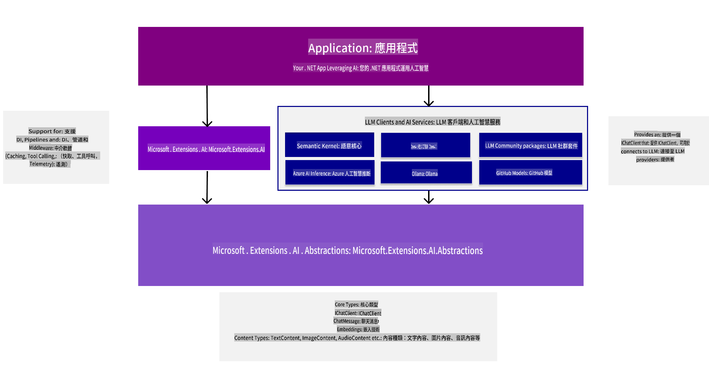
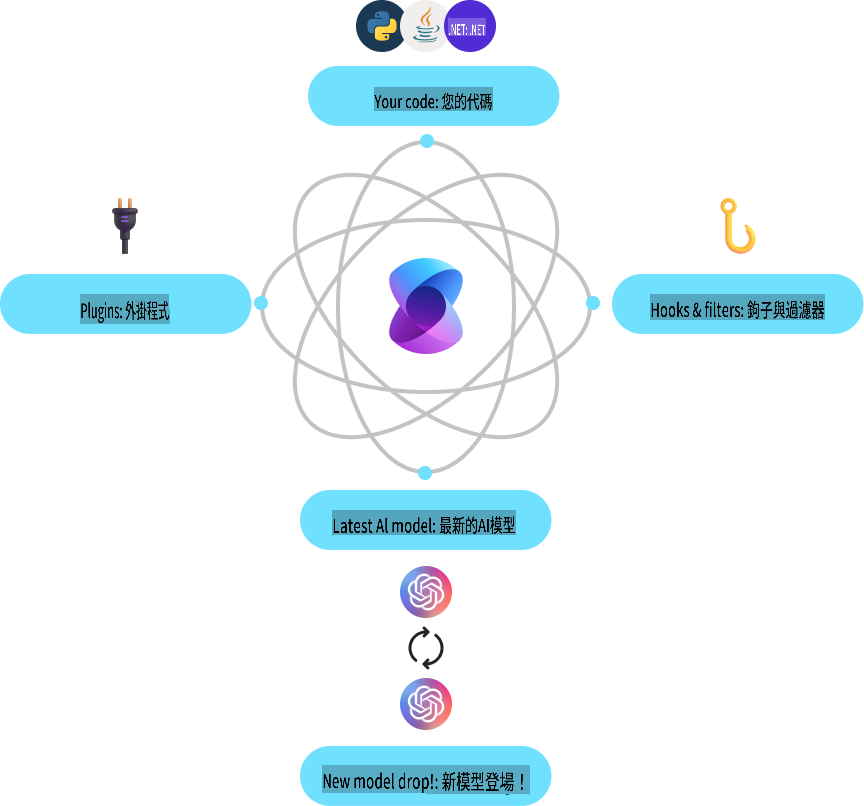
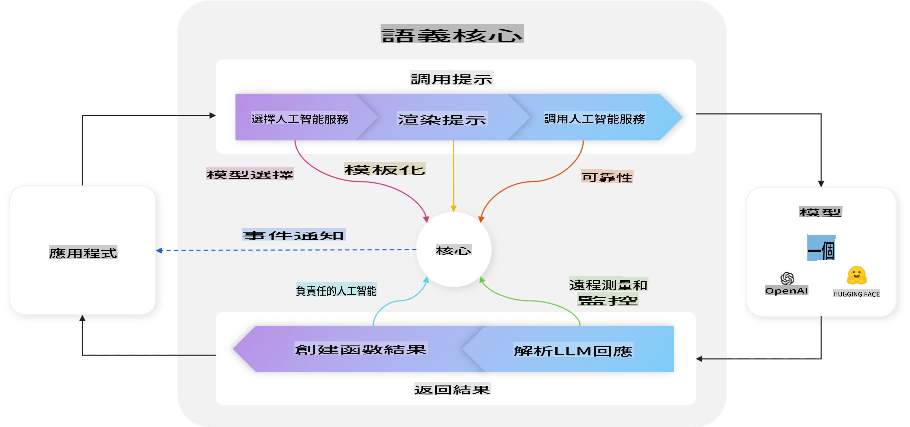
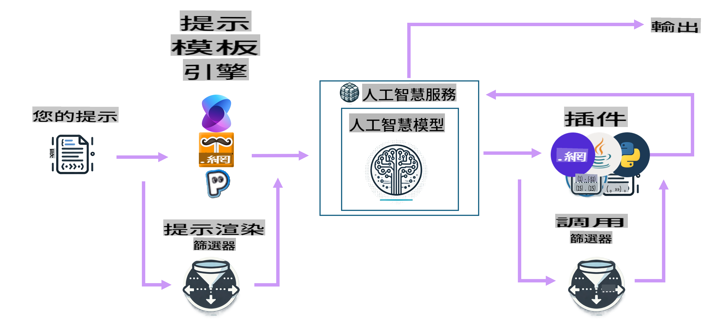

# 開始使用 AI 開發工具

更新您的生成式 AI 知識，並了解 .NET 提供的工具，幫助您開發生成式 AI 應用程式。

---

[](http://www.youtube.com/watch?v=SZvE_meBdvg)

_⬆️點擊圖片觀看影片⬆️_

## 本課程您將學到：

- 🌟 理解生成式 AI 的基本概念及其應用
- 🔍 探索 .NET 的 AI 開發工具，包括 MEAI、Semantic Kernel 和 Azure OpenAI

## .NET 的生成式 AI 基礎

在我們開始撰寫程式碼之前，先花點時間回顧一些生成式 AI（GenAI）的概念。在本課程 **「.NET 的生成式 AI 基礎」** 中，我們將重溫一些基本的 GenAI 概念，讓您了解為什麼某些做法如此進行。此外，我們還會介紹用於構建應用程式的工具和 SDK，例如 **MEAI**（Microsoft.Extensions.AI）、**Semantic Kernel** 和 **VS Code 的 AI 工具擴展**。

### 快速回顧生成式 AI 概念

生成式 AI 是一種可以創造新內容（如文字、圖像或程式碼）的人工智慧，這些內容基於從數據中學習到的模式和關聯。生成式 AI 模型可以生成類似人類的回應、理解上下文，有時甚至能創建看似人類生成的內容。

當您開發 .NET 的 AI 應用程式時，您將使用 **生成式 AI 模型** 來創建內容。生成式 AI 模型的一些能力包括：

- **文字生成**：為聊天機器人、內容和文字補全創建類似人類的文字。
- **圖像生成與分析**：生成真實感圖像、增強照片以及檢測物件。
- **程式碼生成**：撰寫程式碼片段或腳本。

不同的模型針對不同任務進行了優化。例如，**小型語言模型（SLMs）** 適合文字生成，而 **大型語言模型（LLMs）** 更適合進行如程式碼生成或圖像分析這類複雜任務。此外，不同的公司和團隊也會開發模型，例如 Microsoft、OpenAI 或 Anthropic。您選擇使用哪一個，將取決於您的使用場景和所需功能。

當然，這些模型的回應並不總是完美的。您可能聽說過模型「幻覺」或以權威的方式生成錯誤資訊。但您可以透過提供清晰的指示和上下文，幫助引導模型生成更好的回應，而這就是 **提示工程（prompt engineering）** 的用武之地。

#### 提示工程回顧

提示工程是設計有效輸入以引導 AI 模型生成預期輸出的實踐。這包括：

- **清晰性**：確保指示清晰且毫不含糊。
- **上下文**：提供必要的背景資訊。
- **限制**：指定任何限制條件或格式。

提示工程的一些最佳實踐包括提示設計、清晰指示、任務分解、一次學習和少次學習，以及提示微調。此外，嘗試和測試不同的提示，找出最適合您特定使用場景的方法。

需要注意的是，開發應用程式時會涉及不同類型的提示。例如，您需要設定 **系統提示**，用於為模型的回應設定基本規則和上下文。而應用程式用戶輸入到模型的數據則稱為 **用戶提示**。而 **助手提示** 則是模型基於系統提示和用戶提示生成的回應。

> 🧑‍🏫 **了解更多**：在 [GenAI for Beginners 課程的提示工程章節](https://github.com/microsoft/generative-ai-for-beginners/tree/main/04-prompt-engineering-fundamentals) 中了解更多提示工程相關資訊。

#### Tokens、Embeddings 和 Agents - 不要害怕！

當您使用生成式 AI 模型時，會遇到一些術語，例如 **tokens**、**embeddings** 和 **agents**。以下是這些概念的快速概述：

- **Tokens**：Tokens 是模型中的最小文字單元。它們可以是單詞、字符或子詞。Tokens 用於將文字數據表示為模型可以理解的格式。
- **Embeddings**：Embeddings 是 tokens 的向量表示，捕捉單詞和短語的語義意義，讓模型能理解單詞之間的關係並生成上下文相關的回應。
- **向量資料庫**：向量資料庫是 embeddings 的集合，可用於比較和分析文字數據，讓模型根據輸入數據的上下文生成回應。
- **Agents**：Agents 是與模型互動以生成回應的 AI 組件。它們可以是聊天機器人、虛擬助手或其他使用生成式 AI 模型創建內容的應用程式。

在開發 .NET AI 應用程式時，您將使用 tokens、embeddings 和 agents 來創建聊天機器人、內容生成器以及其他 AI 驅動的應用程式。理解這些概念有助於您構建更有效和高效的 AI 應用程式。

### .NET 的 AI 開發工具與函式庫

.NET 提供了多種 AI 開發工具。我們來花點時間了解一些可用的工具和函式庫。

#### Microsoft.Extensions.AI (MEAI)

Microsoft.Extensions.AI (MEAI) 函式庫提供統一的抽象層和中介軟體，簡化將 AI 服務整合到 .NET 應用程式中的過程。

透過提供一致的 API，MEAI 讓開發者可以透過通用介面與不同的 AI 服務互動，例如小型和大型語言模型、embeddings，甚至中介軟體。這降低了構建 .NET AI 應用程式的難度，因為您可以針對不同服務使用相同的 API 開發。

例如，無論使用哪種 AI 服務，以下是使用 MEAI 建立聊天客戶端的介面：

```csharp
public interface IChatClient : IDisposable 
{ 
    Task<ChatCompletion> CompleteAsync(...); 
    IAsyncEnumerable<StreamingChatCompletionUpdate> CompleteStreamingAsync(...); 
    ChatClientMetadata Metadata { get; } 
    TService? GetService<TService>(object? key = null) where TService : class; 
}
```

這樣一來，當使用 MEAI 開發聊天應用程式時，您將針對相同的 API 表面進行開發，以獲取聊天補全或流式傳輸補全、獲取元數據或訪問底層的 AI 服務。這使得更換 AI 服務或根據需要新增服務變得更加容易。

此外，該函式庫還支援記錄、快取和遙測等中介軟體元件，讓開發更健全的 AI 應用程式變得更輕鬆。



透過統一的 API，MEAI 讓開發者能以一致的方式使用不同的 AI 服務，例如 Azure AI Inference、Ollama 和 OpenAI。這簡化了 AI 模型整合到 .NET 應用程式中的過程，並為開發者提供靈活性，以選擇最適合其專案和具體需求的 AI 服務。

> 🏎️ **快速開始**：快速開始使用 MEAI，請參閱 [這篇部落格文章](https://devblogs.microsoft.com/dotnet/introducing-microsoft-extensions-ai-preview/)。
>
> 📖 **文件**：在 [MEAI 文件](https://learn.microsoft.com/dotnet/ai/ai-extensions) 中了解更多有關 Microsoft.Extensions.AI (MEAI) 的資訊。

#### Semantic Kernel (SK)

Semantic Kernel 是一個開源 SDK，幫助開發者將生成式 AI 語言模型整合到其 .NET 應用程式中。它為 AI 服務和記憶體（向量）存儲提供抽象層，允許創建可以由 AI 自動協調的插件。它甚至使用 OpenAPI 標準，讓開發者能夠創建與外部 API 互動的 AI agent。



Semantic Kernel 支援 .NET，以及其他語言如 Java 和 Python，提供大量的連接器、功能和插件以進行整合。Semantic Kernel 的一些關鍵功能包括：

- **Kernel Core**：為 Semantic Kernel 提供核心功能，包括連接器、功能和插件，用於與 AI 服務和模型互動。Kernel 是 Semantic Kernel 的核心，負責服務和插件的調用，監控 Agents，並充當應用程式的中介軟體。

    例如，它可以選擇最適合特定任務的 AI 服務，構建並發送提示到服務，並將回應返回應用程式。以下是 Kernel Core 的運作示意圖：

    

- **AI 服務連接器**：為多個提供者提供抽象層，通過統一介面暴露 AI 服務，例如聊天補全、文字轉圖像、文字轉語音以及語音轉文字。

- **向量存儲連接器**：透過統一介面暴露向量存儲給多個提供者，讓開發者可以處理 embeddings、向量和其他數據表示。

- **功能與插件**：提供一系列用於常見 AI 任務的功能和插件，例如功能處理、提示模板、文字搜索等。這些可以連接到 AI 服務/模型，實現如 RAG 和 agents 的應用。

- **提示模板**：提供提示工程工具，包括提示設計、測試和優化，以提升 AI 模型的性能和準確性。讓開發者可以創建和測試提示，並針對特定任務進行優化。

- **過濾器**：控制功能的執行時機和方式，以增強安全性和負責任的 AI 實踐。

在 Semantic Kernel 中，一個完整的工作流程如下圖所示：



> 📖 **文件**：在 [Semantic Kernel 文件](https://learn.microsoft.com/semantic-kernel/overview/) 中了解更多有關 Semantic Kernel 的資訊。

## 總結

生成式 AI 為開發者提供了無限可能，讓他們能夠創建生成內容、理解上下文以及提供類似人類回應的創新應用程式。.NET 生態系統提供了一系列工具和函式庫，簡化了 AI 開發過程，使 AI 功能更容易整合到 .NET 應用程式中。

## 下一步

在接下來的章節中，我們將深入探討這些場景，提供實際操作示例、程式碼片段以及最佳實踐，幫助您使用 .NET 構建真實世界的 AI 解決方案！

接下來，我們將設置您的開發環境！讓您準備好進入使用 .NET 的生成式 AI 世界！

👉 [設置您的 AI 開發環境](/02-SetupDevEnvironment/readme.md)

**免責聲明**：  
本文件使用基於機器的人工智能翻譯服務進行翻譯。儘管我們努力確保準確性，但請注意，自動翻譯可能包含錯誤或不準確之處。應以原始語言的文件作為權威來源。對於關鍵信息，建議使用專業人工翻譯。我們對因使用本翻譯而產生的任何誤解或誤讀不承擔責任。