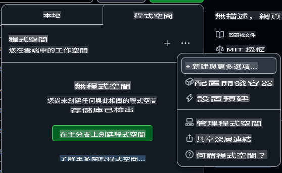
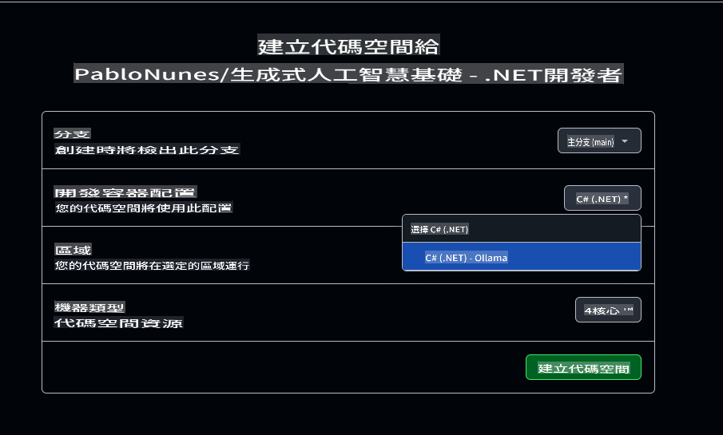

# 使用 Ollama 設定開發環境

如果你希望在本課程中使用 Ollama 來運行本地模型，請按照本指南的步驟進行。

不想使用 Azure OpenAI？

👉 [如果你想使用 GitHub 模型，這是你的指南](README.md)  
👉 [這是 Ollama 的操作步驟](getting-started-ollama.md)

## 建立 GitHub Codespace

接下來，我們將建立一個 GitHub Codespace，作為本課程的開發環境。

1. [右鍵點擊這裡](https://github.com/microsoft/Generative-AI-for-beginners-dotnet)，選擇 **在新視窗中開啟**，以開啟此儲存庫的主頁面。
2. 點擊頁面右上角的 **Fork** 按鈕，將此儲存庫 Fork 到你的 GitHub 帳號。
3. 點擊 **Code** 下拉按鈕，然後選擇 **Codespaces** 分頁。
4. 選擇 **...** 選項（三個點），然後點擊 **New with options...**。



### 選擇開發容器

在 **Dev container configuration** 下拉選單中，選擇以下其中一個選項：

**選項 1: C# (.NET)**：如果你計劃使用 GitHub 模型或 Azure OpenAI，這是推薦的選擇。它包含完成本課程所需的所有核心 .NET 開發工具，並且啟動速度很快。

**選項 2: C# (.NET) - Ollama**：如果你想使用 Ollama 本地運行模型，請選擇此選項。它除了包含核心 .NET 開發工具外，還包含 Ollama，但啟動時間較慢，平均約五分鐘。[按照此指南](getting-started-ollama.md) 設置 Ollama。

其餘設定可以保持預設值。點擊 **Create codespace** 按鈕，開始建立 Codespace 的過程。



## 驗證你的 Codespace 與 Ollama 是否正常運行

當你的 Codespace 完全加載並配置完成後，我們可以運行一個範例應用程式，確認一切正常運作：

1. 開啟終端機。在 macOS 上，你可以按 **Ctrl+\`** (backtick) on Windows or **Cmd+`** 快速打開終端機。

2. 切換到正確的目錄，執行以下命令：

    ```bash
    cd 02-SetupDevEnvironment/src/BasicChat-03Ollama/
    ```

3. 然後使用以下命令運行應用程式：

    ```bash
    dotnet run
    ```

4. 程式運行可能需要幾秒鐘，但最終應該會輸出類似以下的訊息：

    ```bash
    AI, or Artificial Intelligence, refers to the development of computer systems that can perform tasks that typically require human intelligence, such as:

    1. Learning: AI systems can learn from data and improve their performance over time.
    2. Reasoning: AI systems can draw conclusions and make decisions based on the data they have been trained on.
    
    ...
    ```

> 🙋 **需要幫助？**：有問題嗎？[開啟一個 Issue](https://github.com/microsoft/Generative-AI-for-beginners-dotnet/issues/new?template=Blank+issue)，我們會協助你。

## 替換 Ollama 中的模型

Ollama 的一個有趣功能是可以輕鬆更換模型。目前的應用程式使用 "**llama3.2**" 模型。讓我們改用 "**phi3.5**" 模型試試看。

1. 在終端機執行以下命令下載 Phi3.5 模型：

    ```bash
    ollama pull phi3.5
    ```

    你可以在 [Phi3.5](https://ollama.com/library/phi3.5) 和 [Ollama library](https://ollama.com/library/) 中了解更多關於此模型及其他可用模型的資訊。

2. 編輯 `Program.cs` 中的聊天客戶端初始化代碼，改為使用新模型：

    ```csharp
    IChatClient client = new OllamaChatClient(new Uri("http://localhost:11434/"), "phi3.5");
    ```

3. 最後，使用以下命令運行應用程式：

    ```bash
    dotnet run
    ```

4. 恭喜，你已成功切換到新模型！注意到回應變得更長且更具細節。

    ```bash
    Artificial Intelligence (AI) refers to the simulation of human intelligence processes by machines, especially computer systems. These processes include learning (the acquisition of information and accumulation of knowledge), reasoning (using the acquired knowledge to make deductions or decisions), and self-correction. AI can manifest in various forms:

    1. **Narrow AI** – Designed for specific tasks, such as facial recognition software, voice assistants like Siri or Alexa, autonomous vehicles, etc., which operate under a limited preprogrammed set of behaviors and rules but excel within their domain when compared to humans in these specialized areas.

    2. **General AI** – Capable of understanding, learning, and applying intelligence broadly across various domains like human beings do (natural language processing, problem-solving at a high level). General AIs are still largely theoretical as we haven't yet achieved this form to the extent necessary for practical applications beyond narrow tasks.
    
    ...
    ```

> 🙋 **需要幫助？**：有問題嗎？[開啟一個 Issue](https://github.com/microsoft/Generative-AI-for-beginners-dotnet/issues/new?template=Blank+issue)，我們會協助你。

## 小結

在本課程中，你學會了如何為接下來的學習設定開發環境。你建立了一個 GitHub Codespace 並配置為使用 Ollama。此外，你還更新了範例程式碼，學會了如何輕鬆切換模型。

### 更多資源

- [Ollama 模型](https://ollama.com/search)  
- [使用 GitHub Codespaces](https://docs.github.com/en/codespaces/getting-started)  
- [Microsoft AI 擴展文件](https://learn.microsoft.com/en-us/dotnet/)

## 下一步

接下來，我們將探索如何建立你的第一個 AI 應用程式！🚀

👉 [核心生成式 AI 技術](../03-CoreGenerativeAITechniques/readme.md)

**免責聲明**:  
本文件已使用機器翻譯服務進行翻譯。儘管我們努力確保準確性，但請注意，自動翻譯可能包含錯誤或不準確之處。應以原始語言的文件作為權威來源。對於關鍵信息，建議尋求專業人工翻譯。我們對因使用本翻譯而引起的任何誤解或誤讀不承擔責任。