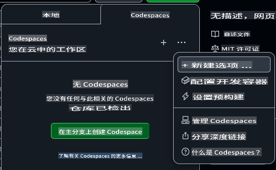
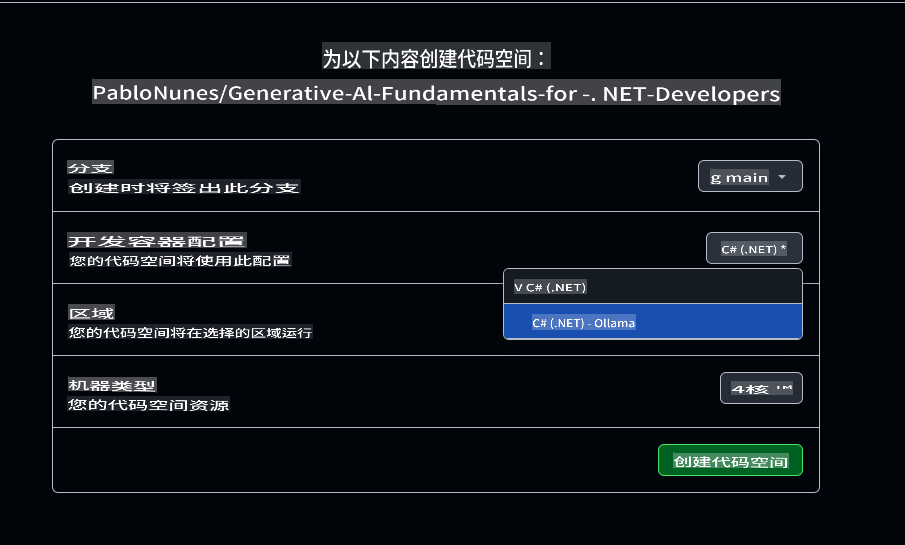

# 使用 Ollama 设置开发环境

如果您希望在本课程中使用 Ollama 运行本地模型，请按照本指南中的步骤操作。

不想使用 Azure OpenAI？

👉 [想用 GitHub 模型？这是适合您的指南](README.md)  
👉 [这是使用 Ollama 的步骤](getting-started-ollama.md)

## 创建 GitHub Codespace

接下来，我们将创建一个 GitHub Codespace，用于完成本课程的开发工作。

1. [右键单击此处](https://github.com/microsoft/Generative-AI-for-beginners-dotnet)，在上下文菜单中选择 **在新窗口中打开**，以打开此代码库的主页。
2. 点击页面右上角的 **Fork** 按钮，将此代码库复制到您的 GitHub 账户中。
3. 点击 **Code** 下拉按钮，然后选择 **Codespaces** 标签。
4. 选择 **...** 选项（三个点图标），然后点击 **New with options...**。



### 选择开发容器

在 **Dev container configuration** 下拉菜单中，选择以下选项之一：

**选项 1: C# (.NET)**：如果您计划使用 GitHub 模型或 Azure OpenAI，这是您应该选择的选项，也是我们推荐的方式来完成本课程。此选项包含本课程所需的所有核心 .NET 开发工具，启动速度较快。

**选项 2: C# (.NET) - Ollama**：如果您计划使用 Ollama 本地运行模型，请选择此选项。它不仅包含所有核心 .NET 开发工具，还额外支持 Ollama，但启动时间稍慢，平均需要五分钟。[按照本指南操作](getting-started-ollama.md) 来使用 Ollama。

其他设置可以保持默认状态。点击 **Create codespace** 按钮以开始创建 Codespace。



## 验证您的 Codespace 是否正确运行 Ollama

当 Codespace 完全加载并配置完成后，我们可以运行一个示例应用程序来验证一切是否正常：

1. 打开终端窗口。在 macOS 上，您可以通过按下 **Ctrl+\`** (backtick) on Windows or **Cmd+`** 来打开终端。

2. 通过运行以下命令切换到正确的目录：

    ```bash
    cd 02-SetupDevEnvironment/src/BasicChat-03Ollama/
    ```

3. 然后运行以下命令启动应用程序：

    ```bash
    dotnet run
    ```

4. 可能需要几秒钟，但最终应用程序应该输出类似以下的信息：

    ```bash
    AI, or Artificial Intelligence, refers to the development of computer systems that can perform tasks that typically require human intelligence, such as:

    1. Learning: AI systems can learn from data and improve their performance over time.
    2. Reasoning: AI systems can draw conclusions and make decisions based on the data they have been trained on.
    
    ...
    ```

> 🙋 **需要帮助？**：遇到问题？[提交一个问题](https://github.com/microsoft/Generative-AI-for-beginners-dotnet/issues/new?template=Blank+issue)，我们会为您提供帮助。

## 在 Ollama 中切换模型

Ollama 的一个很棒的功能是可以轻松切换模型。目前的应用程序使用的是 "**llama3.2**" 模型。接下来让我们切换到 "**phi3.5**" 模型试试。

1. 在终端中运行以下命令下载 Phi3.5 模型：

    ```bash
    ollama pull phi3.5
    ```

    您可以在 [Ollama 模型库](https://ollama.com/library/) 中了解更多关于 [Phi3.5](https://ollama.com/library/phi3.5) 和其他可用模型的信息。

2. 编辑 `Program.cs` 中聊天客户端的初始化代码以使用新模型：

    ```csharp
    IChatClient client = new OllamaChatClient(new Uri("http://localhost:11434/"), "phi3.5");
    ```

3. 最后，运行以下命令启动应用程序：

    ```bash
    dotnet run
    ```

4. 恭喜，您已经切换到了一个新模型。您会注意到响应更长且更详细。

    ```bash
    Artificial Intelligence (AI) refers to the simulation of human intelligence processes by machines, especially computer systems. These processes include learning (the acquisition of information and accumulation of knowledge), reasoning (using the acquired knowledge to make deductions or decisions), and self-correction. AI can manifest in various forms:

    1. **Narrow AI** – Designed for specific tasks, such as facial recognition software, voice assistants like Siri or Alexa, autonomous vehicles, etc., which operate under a limited preprogrammed set of behaviors and rules but excel within their domain when compared to humans in these specialized areas.

    2. **General AI** – Capable of understanding, learning, and applying intelligence broadly across various domains like human beings do (natural language processing, problem-solving at a high level). General AIs are still largely theoretical as we haven't yet achieved this form to the extent necessary for practical applications beyond narrow tasks.
    
    ...
    ```

> 🙋 **需要帮助？**：遇到问题？[提交一个问题](https://github.com/microsoft/Generative-AI-for-beginners-dotnet/issues/new?template=Blank+issue)，我们会为您提供帮助。

## 总结

在本节课程中，您学习了如何为接下来的课程设置开发环境。您创建了一个 GitHub Codespace 并将其配置为使用 Ollama。您还更新了示例代码以轻松切换模型。

### 额外资源

- [Ollama 模型](https://ollama.com/search)  
- [使用 GitHub Codespaces](https://docs.github.com/en/codespaces/getting-started)  
- [Microsoft AI 扩展文档](https://learn.microsoft.com/en-us/dotnet/)  

## 接下来的步骤

接下来，我们将探索如何创建您的第一个 AI 应用程序！🚀

👉 [核心生成式 AI 技术](../03-CoreGenerativeAITechniques/readme.md)

**免责声明**：  
本文件使用基于机器的人工智能翻译服务进行翻译。虽然我们努力确保准确性，但请注意，自动翻译可能包含错误或不准确之处。应以原始语言的文件为权威来源。对于关键信息，建议使用专业的人工翻译。因使用此翻译而引起的任何误解或误读，我们概不负责。